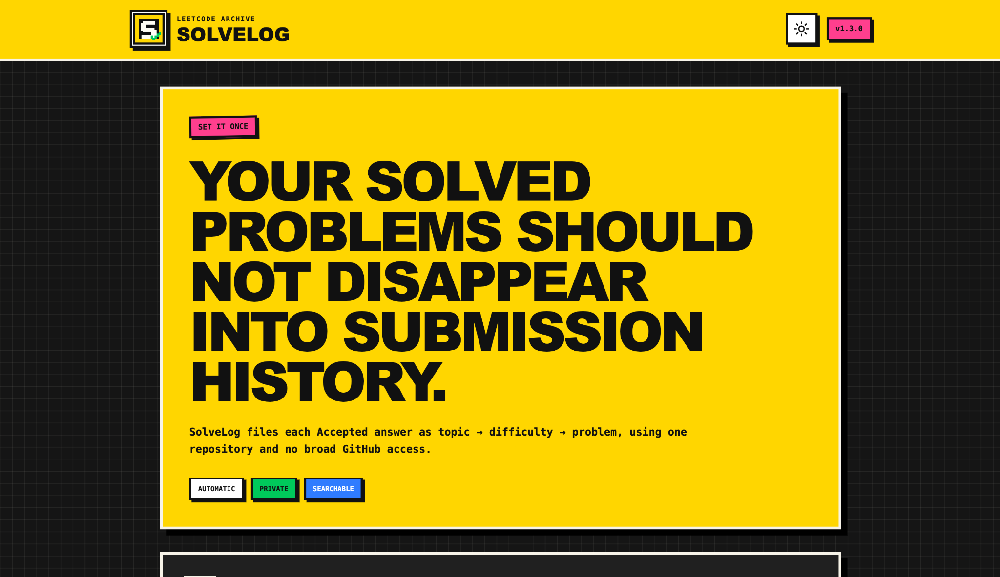
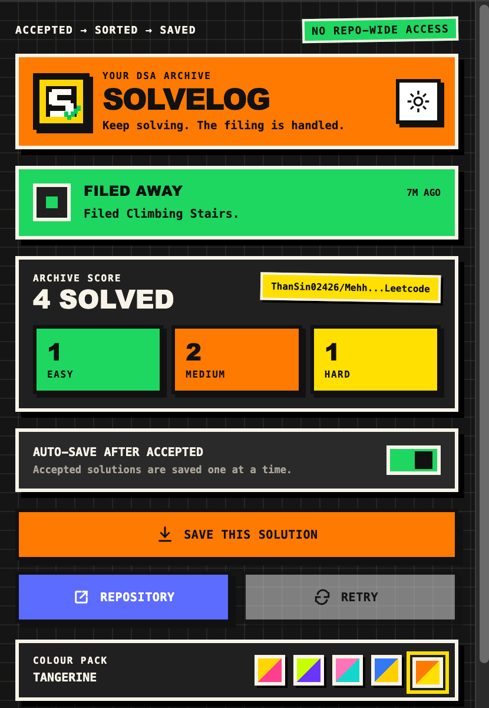
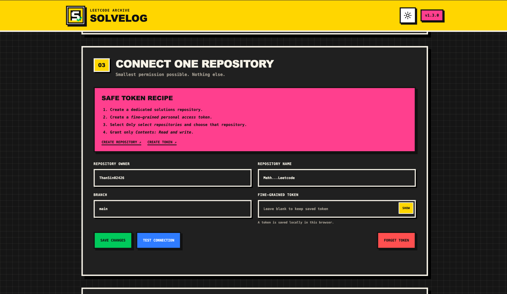

<div align="center">
  

# SolveLog

### Accepted on LeetCode. Organised in GitHub. Kept private during contests.

SolveLog is a free, open-source browser extension that saves **Accepted** LeetCode submissions to a GitHub repository you choose—organised by **topic → difficulty → problem**.

[](#)
[](#)
[](LICENSE)
[](docs/SECURITY.md)

</div>

---

## Why SolveLog exists

A good solution should become part of your study archive—not disappear into submission history.

SolveLog watches for an **Accepted** result, captures the exact code you submitted, and files it into a clean repository. There is no copying, folder renaming, or broad access to every repository in your GitHub account.



## What it does

- Saves only **Accepted** submissions.
- Organises solutions as `Topic / Difficulty / Problem`.
- Stores code, metadata, runtime, memory, tags, and the original problem link.
- Supports multiple programming languages.
- Uses a persistent FIFO queue, so rapid submissions are saved **one at a time**.
- Prevents duplicate commits for the same submission.
- Provides a manual **Save this solution** fallback.
- Includes **Contest Safe Mode** and a local **Contest Vault**.
- Supports light, dark, and system themes with five colour packs.
- Loads no remote JavaScript and includes no analytics or advertising.

<div align="center">
  
</div>

## Contest Safe Mode

Contest Safe Mode is enabled by default.

When SolveLog detects a LeetCode contest route, accepted solutions are stored only in the browser's local **Contest Vault**. Nothing is committed to GitHub until you review and release it.

```text
Accepted during contest
        ↓
Stored locally in Contest Vault
        ↓
Review after the contest
        ↓
Release selected solutions
        ↓
Normal one-at-a-time save queue
```

From SolveLog settings, you can:

- review every locally stored contest solution;
- open the original problem;
- release selected solutions;
- release the entire vault; or
- discard local copies you do not want to publish.

Contest Vault items survive popup closure, tab changes, and browser restarts. They remain local until you release or discard them.

## Safer GitHub access

SolveLog does **not** need permission to every repository in your account.

The recommended setup uses a GitHub **fine-grained personal access token** restricted to:

- **Only one selected repository**
- Repository permission: **Contents — Read and write**
- No classic `repo` scope
- No organisation-wide access

The token is stored locally in `chrome.storage.local`, is never browser-synchronised, is never logged, and is sent only to GitHub's API.



Prefer zero GitHub access? Use **Download mode** and commit the generated files yourself.

## Repository structure

A solved problem is stored once under its primary topic:

```text
leetcode-solutions/
├── README.md
├── .solvelog/
│   └── index.json
├── Arrays/
│   ├── Easy/
│   ├── Medium/
│   └── Hard/
├── Binary-Search/
│   └── Medium/
│       └── 0033-search-in-rotated-sorted-array/
│           ├── README.md
│           ├── metadata.json
│           └── solution.cpp
└── Dynamic-Programming/
    └── Easy/
        └── 0070-climbing-stairs/
            ├── README.md
            ├── metadata.json
            └── solution.cpp
```

Problems with several tags are not copied into several folders. SolveLog chooses one primary topic and keeps the remaining tags in `metadata.json`.

## How normal saving works

```text
Accepted on LeetCode
        ↓
Stored safely in the local queue
        ↓
Problem metadata is collected
        ↓
Latest GitHub branch is fetched
        ↓
README + metadata + code are committed together
        ↓
The next queued solution begins
```

Each submission is written as one atomic commit. The queue survives popup closure, tab changes, browser restarts, and temporary GitHub errors.

## Install from source — free

Until a public store listing is available, install SolveLog directly from this repository.

### Chrome

1. Download or clone this repository.
2. Open `chrome://extensions`.
3. Enable **Developer mode**.
4. Click **Load unpacked**.
5. Select the SolveLog project folder.
6. Open the extension and complete the one-time setup.

### Brave

Use the same steps at `brave://extensions`.

### Microsoft Edge

Use the same steps at `edge://extensions`.

No build step is required for normal use. SolveLog has no runtime dependencies.

## Connect one GitHub repository

1. Create a dedicated repository for your solutions.
2. Create a GitHub **fine-grained personal access token**.
3. Under **Repository access**, choose **Only select repositories**.
4. Select only your solutions repository.
5. Under **Repository permissions**, set **Contents** to **Read and write**.
6. Leave every other permission unchanged.
7. Enter the owner, repository name, branch, and token in SolveLog settings.
8. Click **Test connection**, then save your settings.

Avoid classic personal access tokens with the broad `repo` permission.

## Development

SolveLog is written in plain JavaScript and uses Chrome Manifest V3.

```bash
npm run validate
```

Validation covers:

- extension manifest and required files;
- JavaScript syntax;
- platform-independent submission normalisation;
- Contest Vault storage and release behaviour;
- queue ordering and duplicate suppression;
- service-worker concurrency and retry behaviour.

Create the distributable ZIP with:

```bash
npm run package
```

The extension package is written to `dist/solvelog-v1.4.0.zip`.

## Privacy

SolveLog is intentionally local-first:

- No analytics
- No advertising
- No tracking pixels
- No remote executable code
- No sale of user data
- No copied LeetCode problem statements
- No server operated by SolveLog
- Contest Vault code remains in local extension storage until the user releases it

Read the full [Security model](docs/SECURITY.md) and [Privacy policy](docs/PRIVACY_POLICY.md).

## Known limitations

LeetCode can change its routes, editor, or internal submission endpoints. Automatic detection may occasionally require an update. The manual **Save this solution** button is included so your work is not blocked by a UI change.

Contest Safe Mode recognises LeetCode contest routes. Always review the Contest Vault before publishing solutions after a contest.

Only one LeetCode-to-GitHub extension should be enabled at a time. Running SolveLog alongside LeetHub, LeetPush, or an older SolveLog installation can create competing GitHub writes.

## Contributing

Bug reports and focused pull requests are welcome. Before submitting a change:

1. Keep the extension dependency-free unless a dependency is genuinely necessary.
2. Do not introduce analytics, advertising trackers, or remote executable code.
3. Preserve the one-repository permission model.
4. Preserve Contest Safe Mode as a free safety feature.
5. Run `npm run validate`.
6. Remove tokens, email addresses, and private repository details from logs and screenshots.

## Free edition and future products

This repository contains the free SolveLog edition and remains available under the MIT License. Any future commercial edition, hosted service, or proprietary add-on will be developed and distributed separately. The code already published here remains MIT-licensed.

## License

SolveLog is available under the [MIT License](LICENSE).

“LeetCode” and “GitHub” are trademarks of their respective owners. SolveLog is an independent project and is not affiliated with or endorsed by either company.

---

<div align="center">
  <strong>Accepted → sorted → saved.</strong><br>
  During contests: accepted → vaulted → reviewed → released.
</div>
